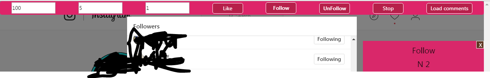

# Zakasmi.InstagramBot

# Instagram unlimited auto Like follow Unfollow Bot 2017 

  

Features :
Follow all users of a specific Account ,
Unfollow Your followers .
auto Like Instagram Posts 
Calculate The Total Comments and Tagged People on a post 

# Requirements or How To Install?

It depends on which browser you use. Typically, you will need to install a browser extension or addon. Once user scripts are enabled in your browser, 
Browser and Required extension or addon

Before installing this user script you need to install one of the following browser extension or addon...
For Firefox and related

Greasemonkey addon
I did not yet tested this script using Scriptish addon for Firefox you may try..
For Google Chrome, Chromium, and related

Tampermonkey extention 
For Opera (version 15 and later)

Tampermonkey addon
Violentmonkey addon
For Opera (version 12 and earlier)
Opera version 12 and earlier supports user scripts natively. Violentmonkey provides a friendlier UI and better compatibility.

# How To use 
After Adding the Extension click on the TamberMonkey Icon then go to Dashboard and Click the add icon 
Now Copy and past The Script , click Save . and you're ready to go

How to follow and Unfollow 
- Visit instagram enter the Total Follow  Or Unfollow number , 
set the Min Second and The Mas seconds (this is one is used to stop the bot for a while if set low numbers your account will get yourself banned so make sure to set min seconds +35 ) then click on Follow and Unfollow . then click on The Followers or Following list
PS . Click on The button before Displaying the Followers or followin list
- For Liking just set Min and Max and Total and hit the like button . 

